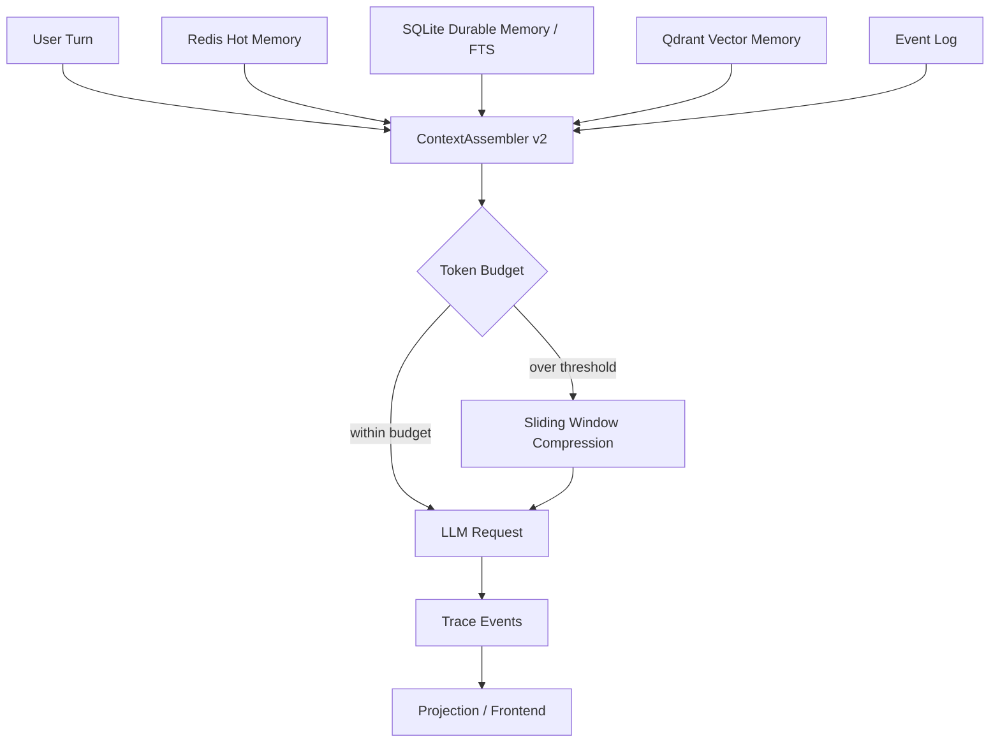

# Tenet 上下文管理与多层记忆系统优化方案

> 目标：在 Tenet 现有 Event Store、ContextAssembler、Session/Workspace Summary、Redis Lock/Event Stream 的基础上，升级为“可追踪、可压缩、可检索、可注入、可回放”的上下文与记忆系统。
>
> 参考来源：本方案参考了 Shannon 的 `context-window-management.md` 与 `memory-system-architecture.md`，但不照搬其 PostgreSQL/Temporal 架构，而是按 Tenet 当前 Go Orchestrator + Python Worker + SQLite/Redis 的技术路线设计。

## 1. 当前 Tenet 现状

Tenet 已经具备上下文和记忆系统的雏形：

- `go/internal/context/assembler`：已有 ContextAssembler，支持消息裁剪、token 估算、included/omitted refs。
- `ContextAssembled / ContextCompacted`：每次 LLM 调用前会记录上下文组装事件。
- `SessionSummaryCreated / WorkspaceSummaryCreated`：Run 成功后会生成基础摘要事件。
- `memory_entries + FTS5`：SQLite 已有 memory entry 和全文检索能力。
- `SearchMemory`：支持基于 SQLite FTS 的关键词检索。
- `Redis`：当前主要用于 session lock、fencing token、rate limit 和 event stream。
- `TokenBudgetExceeded`：已有 token budget 强制中断能力。

但当前仍有明显短板：

- 上下文管理策略比较简单，主要是按 message 数量和 token 粗估裁剪。
- Summary 生成逻辑偏简单，没有形成层级摘要。
- Redis 还没有承担“热记忆 / 活跃上下文缓存”的职责。
- SQLite FTS 只能做关键词检索，缺少向量语义检索。
- 没有针对不同 workflow 的上下文预设，例如 coding/debugging/research。
- 上下文压缩缺少质量评估、压缩比指标和摘要版本管理。
- 记忆注入过程不够明确，前端难回答“为什么这条记忆被注入”。

## 2. 优化目标

### 2.1 Agent 能力目标

优化后，Tenet 的 Agent 应该具备：

- 多轮会话中保留关键上下文。
- 长任务中自动压缩历史，避免上下文窗口爆炸。
- 能从历史任务、工具结果、workspace 摘要中召回相关记忆。
- 能区分当前短期上下文、会话长期记忆、项目级工作区记忆。
- 能根据 workflow 类型选择不同上下文策略。

### 2.2 工程目标

优化后，系统应满足：

- 每次上下文拼接可追踪。
- 每次记忆检索可解释。
- 每次压缩可审计。
- token 预算可配置、可强制、可观测。
- Replay 时不触发新的外部检索或摘要生成。
- 记忆系统失败时优雅降级，不影响任务主流程。

## 3. 推荐总体架构

建议 Tenet 采用三层记忆 + 一个上下文编排器：

```text
Redis Hot Memory
  -> 活跃 session 消息缓存、运行中上下文状态、预算计数、压缩状态

SQLite Durable Memory
  -> Event Store、Session Summary、Workspace Summary、Tool Result Summary、FTS 关键词检索

Qdrant Vector Memory
  -> 语义检索、相似历史任务召回、代码/文档 chunk 召回、分解模式召回

Context Orchestrator / ContextAssembler v2
  -> 选择、排序、压缩、注入、预算控制、Trace 记录
```

架构图：



## 4. 多层记忆设计

### 4.1 L0：当前 Run 工作记忆

用途：

- 当前 run 的临时消息、工具结果、计划步骤。
- 不一定长期保存，但会通过事件日志沉淀。

建议存储：

- Go 内存中的 workflow messages。
- 事件日志中的 `ContextAssembled`、`ToolCallCompleted`、`LLMCallCompleted`。

适合注入：

- 当前用户 turn。
- 本轮刚执行的工具结果。
- 当前 coding workflow 的计划和失败测试输出。

### 4.2 L1：Redis 热记忆

用途：

- 活跃 session 的最近消息窗口。
- 当前 session 的 token 使用实时计数。
- 压缩状态，例如最近一次压缩摘要 id。
- 最近 N 条高频访问记忆缓存。

建议 Redis key：

```text
tenet:session:{session_id}:messages
tenet:session:{session_id}:budget
tenet:session:{session_id}:compression
tenet:session:{session_id}:memory_cache
```

建议数据结构：

- List：最近消息。
- Hash：预算与压缩元数据。
- Set/ZSet：最近检索到的 memory ids。

保留策略：

- 默认 TTL：30 天。
- 每个 session 最多保留 500 条原始消息元数据。
- Redis 只作为热缓存，不作为唯一事实来源。

### 4.3 L2：SQLite 持久记忆

用途：

- 可靠保存可审计记忆。
- 支持 FTS 关键词检索。
- 与 Event Store 保持同库，便于回溯。

建议扩展 `memory_entries`：

```text
id
stream_id
turn_id
run_id
workspace
kind
content
summary_level
source_event_seq
importance
token_estimate
expires_at
created_at
```

建议 memory kind：

```text
session_summary
workspace_summary
tool_result_summary
code_change_summary
decision_summary
failure_summary
user_preference
workflow_pattern
```

用途示例：

- `session_summary`：用户这一轮要什么，Agent 做了什么。
- `workspace_summary`：项目结构、关键文件、当前修改状态。
- `tool_result_summary`：长工具输出的摘要，例如测试失败日志。
- `code_change_summary`：本轮修改了哪些文件、为什么改。
- `failure_summary`：失败模式与修复策略。

### 4.4 L3：Qdrant 向量记忆

用途：

- 语义检索，而不是只靠关键词。
- 跨长会话召回相似任务和相似代码上下文。
- 支持 workspace / session / kind / time range filter。

推荐 collection：

```text
tenet_session_memories
tenet_workspace_memories
tenet_tool_results
tenet_code_chunks
tenet_workflow_patterns
```

payload 字段：

```json
{
  "stream_id": "...",
  "session_id": "...",
  "turn_id": "...",
  "run_id": "...",
  "workspace": "...",
  "kind": "workspace_summary",
  "source": "sqlite:memory_entries:123",
  "event_seq": 42,
  "created_at": "...",
  "importance": 0.8
}
```

降级策略：

- 没有 Qdrant 或 embedding key 时，不阻塞 Agent。
- 只使用 SQLite FTS。
- 记录 `MemoryRetrievalSkipped`，说明原因。

## 5. 上下文管理系统设计

建议把当前 `ContextAssembler` 升级为 `ContextAssembler v2`，能力从“简单裁剪”升级为“上下文编排”。

### 5.1 输入

```text
system prompt
current user turn
recent messages
recent tool results
session summary
workspace summary
retrieved memory
workflow plan
token budget
workflow type
```

### 5.2 输出

```text
messages
included_refs
omitted_refs
memory_refs
compression_refs
estimated_tokens
input_chars
budget
compacted
strategy
```

### 5.3 上下文分区

建议每次 LLM 请求的上下文按区域组织：

```text
System Instructions
Task Goal
Current Turn
Pinned Facts
Session Summary
Workspace Summary
Retrieved Memories
Recent Conversation
Recent Tool Results
Workflow State
```

其中：

- `Current Turn` 永远保留。
- `System Instructions` 永远保留。
- `Pinned Facts` 高优先级保留。
- `Recent Tool Results` 对 coding/debugging 非常重要。
- `Retrieved Memories` 根据相关性和预算动态注入。
- `Recent Conversation` 使用滑动窗口保留。

## 6. Token 预算策略

### 6.1 配置项建议

在 `config/tenet.example.yaml` 增加：

```yaml
context:
  history_window_default: 50
  history_window_debugging: 75
  primers_count: 3
  recents_count: 20
  compression_trigger_ratio: 0.75
  compression_target_ratio: 0.375
  max_context_tokens: 50000
  max_memory_tokens: 8000
  max_tool_result_tokens: 12000
  enable_vector_memory: false

memory:
  redis_ttl_hours: 720
  sqlite_fts_enabled: true
  vector_provider: qdrant
  qdrant_url: http://127.0.0.1:6333
  embedding_provider: openai
  embedding_model: text-embedding-3-small
  max_retrieved_memories: 8
  mmr_lambda: 0.7
```

### 6.2 预算分配建议

一次 LLM 请求的 token 预算可拆成：

```text
system prompt:       10%
current turn:        10%
recent conversation: 25%
tool results:        25%
memory injection:    15%
workspace summary:   10%
reserved buffer:      5%
```

coding/debugging workflow 可调整为：

```text
tool results:        35%
recent conversation: 20%
workspace summary:   15%
memory injection:    10%
reserved buffer:     10%
```

research workflow 可调整为：

```text
retrieved memory:    30%
recent conversation: 20%
tool results:        20%
workspace summary:   10%
reserved buffer:     10%
```

## 7. 滑动窗口压缩方案

参考 Shannon 的滑动窗口思想，但按 Tenet 的事件语义实现：

```text
原始历史：
[系统/最早需求] + [大量中间消息/工具结果] + [最近对话]

压缩后：
[前 N 条 primer] + [中间摘要] + [最近 M 条 recents] + [相关记忆]
```

默认参数：

- primers_count：3
- recents_count：20
- compression_trigger_ratio：0.75
- compression_target_ratio：0.375

压缩保留内容：

- 初始目标与约束。
- 用户明确偏好。
- 关键决策。
- 工具失败和修复结果。
- 文件修改摘要。
- 最近对话流。

新增事件：

```text
ContextCompressionStarted
ContextCompressionCompleted
ContextCompressionFailed
ContextSummaryInjected
```

事件 payload 示例：

```json
{
  "session_id": "...",
  "turn_id": "...",
  "run_id": "...",
  "original_tokens": 82000,
  "compressed_tokens": 18000,
  "tokens_saved": 64000,
  "compression_ratio": 0.78,
  "primer_count": 3,
  "recent_count": 20,
  "summary_memory_id": 123
}
```

## 8. 记忆检索与注入策略

### 8.1 检索流程

```text
Current Query
  -> Redis hot memory
  -> SQLite FTS keyword search
  -> Qdrant vector search
  -> merge
  -> deduplicate
  -> MMR rerank
  -> budget trim
  -> inject into context
```

### 8.2 检索优先级

默认优先级：

1. 当前 session 的最近记忆。
2. 当前 workspace 的摘要记忆。
3. 与当前 query 语义相似的历史任务。
4. 近期失败模式。
5. 用户偏好。

### 8.3 去重策略

按以下 key 去重：

```text
memory_entry_id
source_event_seq
content_hash
vector_payload.source
```

### 8.4 MMR 重排序

使用 MMR 避免召回内容高度重复：

```text
score = λ * relevance - (1 - λ) * similarity_to_selected
```

建议默认：

```text
lambda = 0.7
candidate_pool = max_retrieved_memories * 3
```

## 9. Context Trace 设计

每次上下文拼接必须能回答：

- 这次 LLM 输入包含了哪些历史消息？
- 哪些消息被省略？
- 注入了哪些 memory？
- 为什么注入这些 memory？
- 压缩节省了多少 token？
- 当前使用了哪个上下文策略？

增强 `ContextAssembled` payload：

```json
{
  "session_id": "...",
  "turn_id": "...",
  "run_id": "...",
  "strategy": "coding_debug",
  "message_count": 18,
  "estimated_tokens": 14200,
  "input_chars": 56800,
  "token_budget": 50000,
  "included_refs": [],
  "omitted_refs": [],
  "memory_refs": [
    {
      "memory_id": 123,
      "kind": "workspace_summary",
      "score": 0.84,
      "source": "sqlite_fts"
    }
  ],
  "compression_refs": []
}
```

新增事件：

```text
MemoryRetrievalStarted
MemoryRetrievalCompleted
MemoryRetrievalSkipped
MemoryInjected
MemoryWriteScheduled
MemoryWriteCompleted
MemoryWriteFailed
```

## 10. Replay 兼容策略

上下文和记忆系统不能破坏 Tenet 的 Replay。

规则：

- Replay 不允许真实 Redis/Qdrant 检索影响结果。
- Replay 应消费历史 `MemoryRetrievalCompleted` 和 `ContextAssembled` 事件。
- 如果历史事件中没有 memory retrieval，Replay 不能新增该事件。
- 摘要生成和 embedding 写入必须通过 `Decide` 或 post-run fire-and-forget 事件隔离。

推荐做法：

```text
执行模式：
  retrieve memory -> record MemoryRetrievalCompleted -> assemble context

Replay 模式：
  consume MemoryRetrievalCompleted -> assemble same logical context refs
```

## 11. 隐私与安全

记忆系统会保存更多历史信息，因此必须加强治理：

- 默认 session 之间隔离，禁止跨 session 检索。
- workspace 记忆默认只在同 workspace 下检索。
- 跨 workspace / 跨 session 记忆需要显式配置。
- 写入 memory 前做 secret redaction。
- PII 尽力脱敏，例如 email、手机号、API key。
- Qdrant payload 不保存原始 secret。
- Memory 删除需要同步 SQLite 与 Qdrant。

新增配置：

```yaml
memory:
  cross_session_enabled: false
  cross_workspace_enabled: false
  redact_before_write: true
  default_ttl_hours: 720
```

## 12. 前端/API 展示建议

API 应增加：

```text
GET /api/v1/tasks/{id}/context
GET /api/v1/tasks/{id}/memory
GET /api/v1/memory/search?q=...
```

前端 Trace 面板应显示：

- Context Strategy。
- Token Budget 使用率。
- Included / Omitted messages。
- Injected memories。
- Compression history。
- Memory source：Redis / SQLite FTS / Qdrant。
- Memory score 与 reason。

## 13. 实施路线图

### Phase 1：增强 ContextAssembler

目标：

- 增加上下文分区。
- 增加 strategy 字段。
- 增强 `ContextAssembled` payload。
- 增加 workflow preset：default / coding / debugging / research。

验收：

- 每次 LLM 调用都能看到 strategy、memory refs、omitted refs。
- 不接入 Qdrant 时仍保持现有功能。

### Phase 2：Redis 热记忆

目标：

- 活跃 session 最近消息写入 Redis。
- Redis 保存 compression state。
- Redis 保存预算实时计数。

验收：

- 连续多轮 session 可从 Redis 快速恢复最近消息。
- Redis 不可用时自动退回 SQLite/event history。

### Phase 3：SQLite 记忆增强

目标：

- 扩展 `memory_entries` schema。
- 增加 `kind / importance / token_estimate / source_event_seq`。
- 增加 tool result summary、code change summary、failure summary。

验收：

- `SearchMemory` 能按 kind/workspace/session 过滤。
- Projection 能展示 memory refs。

### Phase 4：滑动窗口压缩

目标：

- 实现 primer + summary + recents。
- 新增压缩事件。
- 摘要写入 memory_entries。

验收：

- 构造 500 条消息时自动压缩。
- `ContextCompacted` 能显示 token saved 和 compression ratio。

### Phase 5：Qdrant 向量记忆

目标：

- 新增 MemoryRetriever 接口。
- 实现 SQLite FTS Retriever。
- 实现 Qdrant Retriever。
- 支持 MMR rerank。

验收：

- 无 Qdrant 时不影响任务。
- 有 Qdrant 时能召回语义相关历史。
- memory retrieval 有 Trace。

### Phase 6：Replay 与测试矩阵

目标：

- replay fixture 覆盖 memory retrieval。
- e2e 覆盖长上下文压缩。
- e2e 覆盖 memory fallback。

验收：

- Replay 不触发真实 Qdrant/embedding 调用。
- no-key smoke 在无 embedding key 时通过。

## 14. 推荐新增 Go 接口

```go
type MemoryStore interface {
    Save(ctx context.Context, entry MemoryEntry) (MemoryEntry, error)
    Search(ctx context.Context, query MemoryQuery) ([]MemoryResult, error)
}

type MemoryRetriever interface {
    Retrieve(ctx context.Context, query RetrievalQuery) ([]RetrievedMemory, error)
}

type ContextStrategy interface {
    Assemble(ctx context.Context, input ContextInput) (ContextOutput, error)
}
```

推荐目录：

```text
go/internal/memory/
  store.go
  redis_hot.go
  sqlite_store.go
  qdrant.go
  retriever.go
  rerank.go

go/internal/context/
  assembler/
    assembler.go
    strategy.go
    compression.go
    trace.go
```

## 15. 简历/项目描述可用表达

如果后续要在项目文档或简历中概括，可以写：

> 基于 Redis / SQLite / Qdrant 构建多层记忆系统，使用 Redis 管理活跃会话热状态，SQLite 持久化事件、摘要与 FTS 记忆，Qdrant 提供语义检索；通过 ContextAssembler 实现上下文选择、滑动窗口压缩、Token 预算控制和记忆动态注入。

更短版本：

> 实现分层记忆与上下文编排系统，支持短期热记忆、长期摘要记忆、语义检索、上下文压缩、Token 预算控制和 Trace 可观测。

## 16. 最终完成标准

当以下能力都满足时，Tenet 的上下文与记忆系统可以认为达到可用版本：

- 多轮 session 能持续保留关键上下文。
- 长任务自动触发上下文压缩。
- 每次 LLM 输入都能追踪上下文来源。
- 能检索并注入 session/workspace/tool/code/failure 记忆。
- Redis/SQLite/Qdrant 任一层不可用时可优雅降级。
- Replay 不受实时记忆检索影响。
- 前端可展示 included/omitted context、injected memories 和 compression stats。
- e2e 覆盖压缩、检索、降级、Replay。

## 17. 当前实现进度

截至本轮实现，已落地：

- Phase 1 ContextAssembler v2：已实现 strategy、primer + recents、memory refs、memory block 注入、token 估算、tokens_saved、compression_ratio、original_tokens。
- Workflow 上下文接入：已按 workflow 类型选择上下文策略与窗口，`ContextAssembled` payload 已包含 strategy、memory_refs、压缩指标和窗口参数。
- Memory Retrieval 基础能力：已新增 `go/internal/memory` Retriever 接口与 SQLite FTS Retriever，实现 query tokenization、session/workspace/kind 过滤、预算裁剪和可解释 reason。
- Memory Trace：已记录 `MemoryRetrievalStarted`、`MemoryRetrievalCompleted`、`MemoryRetrievalSkipped`、`MemoryInjected`，Replay 模式只消费历史事件，不触发真实检索。
- Projection 展示：TaskView 已新增 `memory_retrievals`，ContextState 已包含 memory refs、strategy、compression ratio、tokens saved、original tokens。
- SQLite 持久记忆增强：`memory_entries` 已扩展 workspace、summary_level、source_event_seq、importance、token_estimate、expires_at，并兼容旧库补列。
- 压缩 Trace：已新增 `ContextCompressionStarted`、`ContextCompressionCompleted` timeline，旧 replay 通过 version marker 兼容。

仍待继续：

- Redis Hot Memory 尚未接入运行路径，需要统一 Redis client 注入后保存活跃 session 最近消息、预算状态和 compression state。
- Qdrant Vector Memory 尚未实现，需要先接 embedding provider，再实现 Qdrant retriever 与 MMR rerank。
- Memory 写入类型还需扩展到 tool_result_summary、code_change_summary、failure_summary、workflow_pattern。
- 前端/API 还需展示新的 `memory_retrievals`、压缩 timeline 和 ContextState 详情。
