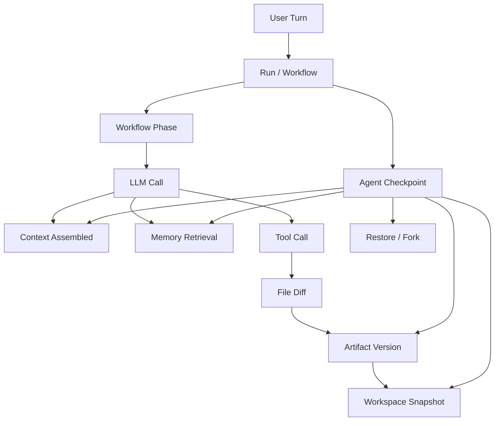

# Tenet 执行链路追踪、产物溯源与回退优化方案

> 目标：在 Tenet 现有 SQLite Event Store、Workflow Replay、Projection、Workspace Snapshot/Fork 的基础上，补齐“Agent 执行链路结构化追踪”和“执行产物版本溯源与回退”能力，使用户可以看清 Agent 每一步为什么发生、产生了什么文件变化，并能回到历史状态继续执行。

## 1. 当前 Tenet 现状

Tenet 当前已经具备回溯系统的基础：

- `event_log`：所有 workflow 关键行为以 append-only event 形式写入 SQLite。
- `WorkflowContext.Decide`：把 LLM 调用和外部副作用包装成可 replay 的决策事件。
- `Replay`：读取历史事件重新执行 workflow，验证事件序列是否 deterministic。
- `Projection`：把事件日志投影成任务状态、timeline、LLM call、tool call、context、memory retrieval。
- `WorkspaceSnapshot`：run 成功后可保存 workspace 快照。
- `ForkStream` / `ForkWorkspace`：可基于父 stream 某个 seq 创建子 stream，并恢复最近 workspace snapshot。
- `VersionMarker`：用于兼容 workflow 代码演进，避免老任务 replay 被新增事件破坏。

但当前回溯能力仍偏“底层事件可重放”，距离用户视角的“可追踪、可溯源、可回退”还有差距。

## 2. 当前主要缺口

### 2.1 Agent 执行链路不够结构化

现在 timeline 可以显示事件，但还没有一个稳定的 Trace 数据模型表达：

- 一个 user turn 分成哪些 workflow phase。
- 每个 phase 调用了几次 LLM。
- 每次 LLM 输入由哪些上下文、记忆、工具结果组成。
- 每次 LLM 输出触发了哪些工具。
- 每个工具产生了哪些文件变更和产物。
- 每个产物由哪个 LLM call、tool call、event seq 产生。

### 2.2 回放不等于恢复

当前 `Replay` 主要用于验证历史事件是否能 deterministic 重演。它不等价于：

- 恢复到某个 turn 前的 Agent 运行状态。
- 恢复当时的上下文窗口。
- 恢复当时的 memory 可见集合。
- 恢复当时的 workspace 文件状态。
- 从该状态继续执行新的用户指令。

### 2.3 Workspace Snapshot 粒度偏粗

目前 snapshot 主要在 run completed 后捕获。如果用户想回退到：

- 某次工具调用之前。
- 某次文件写入之前。
- 三个提示词之前。
- 某个 workflow phase 中间。

可能没有对应 workspace snapshot。

### 2.4 工具副作用缺少事务边界

工具调用已经有 `ToolCallStarted/Completed/Failed`，也能推断 touched files，但还缺少：

- tool 执行前的 before snapshot。
- tool 执行后的 after snapshot。
- 文件 diff。
- artifact manifest。
- rollback patch。
- 工具副作用与审批/fencing token 的绑定关系。

### 2.5 产物没有独立版本模型

Agent 生成的代码、文档、配置、测试结果、报告，目前主要散落在 workspace 文件系统和 event payload 中，没有统一 artifact registry。

用户很难问：

- 这个文件是谁改的？
- 哪个 prompt 触发了这个改动？
- 哪个 LLM call 决定改它？
- 这个产物经历了几个版本？
- 能否只回退这个文件，而不是整个 workspace？

## 3. 优化目标

### 3.1 用户视角目标

用户应该可以做到：

- 查看一个任务的完整 Agent 执行链路。
- 点开某个步骤，看到 LLM 输入摘要、输出、工具调用、文件变化。
- 查看某个文件/产物的来源：由哪个 turn、run、phase、LLM call、tool call 生成。
- 回退整个任务到某个 checkpoint。
- 只回退某个产物或某几个文件。
- 从历史 checkpoint fork 一个新分支继续执行。
- 对比两个 checkpoint 之间的文件、上下文、工具、token、memory 差异。

### 3.2 工程视角目标

系统应该满足：

- Event Store 仍是事实来源。
- Trace 是结构化 Projection，不替代 event log。
- Artifact Registry 只保存产物元数据和版本引用，不直接替代 workspace。
- Workspace Snapshot/Diff 负责真实文件恢复。
- Replay 不触发真实 LLM、工具、Redis、Qdrant、embedding。
- Restore/Fork 明确区分：restore 修改当前 workspace，fork 创建新 stream/workspace。
- 所有回退操作自身也必须写事件，保证回退动作可审计。

## 4. 推荐总体架构

建议新增三层能力：

```text
Structured Trace Layer
  -> TraceSpan / Phase / LLMCall / ToolCall / Context / Memory / Artifact 关系图

Artifact Versioning Layer
  -> Artifact Registry / Artifact Version / File Diff / Producer Link

Checkpoint Restore Layer
  -> AgentCheckpoint / WorkspaceSnapshot / MemorySnapshot / Restore / Fork
```

整体关系：



## 5. 核心概念设计

### 5.1 TraceSpan

TraceSpan 表示 Agent 执行链路中的一个结构化节点。

推荐 span 类型：

```text
session
turn
run
workflow_phase
llm_call
context_assembly
memory_retrieval
tool_call
artifact_write
checkpoint
restore
fork
```

每个 span 包含：

```json
{
  "span_id": "span:...",
  "parent_span_id": "span:...",
  "stream_id": "task:...",
  "turn_id": "turn:...",
  "run_id": "run:...",
  "type": "tool_call",
  "name": "write_file",
  "status": "completed",
  "started_seq": 12,
  "completed_seq": 16,
  "started_at": "...",
  "completed_at": "...",
  "input_ref": "...",
  "output_ref": "...",
  "error": "",
  "attributes": {}
}
```

### 5.2 AgentCheckpoint

AgentCheckpoint 是真正回溯系统的核心。它把“事件位置”和“可恢复状态”绑定起来。

字段建议：

```text
id
stream_id
turn_id
run_id
event_seq
workflow_type
workflow_phase
reason
context_state_json
memory_state_json
token_state_json
tool_state_json
workspace_snapshot_id
artifact_manifest_id
created_at
```

checkpoint 类型：

```text
turn_started
llm_before_call
tool_before_call
tool_after_call
phase_completed
run_completed
manual
restore_point
```

### 5.3 Artifact

Artifact 表示 Agent 生成或修改的执行产物。

Artifact 不只包括文件，也包括：

- 代码文件。
- 配置文件。
- 文档。
- 测试报告。
- 计划文档。
- patch。
- 运行日志摘要。
- 数据文件。

字段建议：

```text
id
stream_id
workspace
path
artifact_type
current_version_id
created_by_event_seq
created_by_span_id
created_at
updated_at
```

### 5.4 ArtifactVersion

ArtifactVersion 表示某个产物的一个版本。

字段建议：

```text
id
artifact_id
version
stream_id
turn_id
run_id
event_seq
producer_span_id
producer_llm_call_id
producer_tool_call_id
content_hash
size_bytes
snapshot_ref
diff_ref
summary
created_at
```

通过它可以回答：

- 这个版本是谁生成的？
- 发生在哪个提示词之后？
- 对应哪个工具调用？
- 能否回退到这个版本？

## 6. 建议数据库 Schema

### 6.1 trace_spans

```sql
CREATE TABLE IF NOT EXISTS trace_spans (
  id TEXT PRIMARY KEY,
  stream_id TEXT NOT NULL,
  parent_id TEXT,
  turn_id TEXT,
  run_id TEXT,
  type TEXT NOT NULL,
  name TEXT NOT NULL,
  status TEXT NOT NULL,
  started_seq INTEGER NOT NULL,
  completed_seq INTEGER,
  started_at TEXT NOT NULL,
  completed_at TEXT,
  input_ref TEXT,
  output_ref TEXT,
  error TEXT,
  attributes_json TEXT NOT NULL DEFAULT '{}'
);
```

### 6.2 agent_checkpoints

```sql
CREATE TABLE IF NOT EXISTS agent_checkpoints (
  id TEXT PRIMARY KEY,
  stream_id TEXT NOT NULL,
  turn_id TEXT,
  run_id TEXT,
  event_seq INTEGER NOT NULL,
  workflow_type TEXT,
  workflow_phase TEXT,
  reason TEXT NOT NULL,
  context_state_json TEXT NOT NULL DEFAULT '{}',
  memory_state_json TEXT NOT NULL DEFAULT '{}',
  token_state_json TEXT NOT NULL DEFAULT '{}',
  tool_state_json TEXT NOT NULL DEFAULT '{}',
  workspace_snapshot_id INTEGER,
  artifact_manifest_id TEXT,
  created_at TEXT NOT NULL DEFAULT (datetime('now'))
);
```

### 6.3 artifacts

```sql
CREATE TABLE IF NOT EXISTS artifacts (
  id TEXT PRIMARY KEY,
  stream_id TEXT NOT NULL,
  workspace TEXT NOT NULL,
  path TEXT NOT NULL,
  artifact_type TEXT NOT NULL,
  current_version_id TEXT,
  created_by_event_seq INTEGER NOT NULL,
  created_by_span_id TEXT,
  created_at TEXT NOT NULL DEFAULT (datetime('now')),
  updated_at TEXT NOT NULL DEFAULT (datetime('now')),
  UNIQUE(stream_id, workspace, path)
);
```

### 6.4 artifact_versions

```sql
CREATE TABLE IF NOT EXISTS artifact_versions (
  id TEXT PRIMARY KEY,
  artifact_id TEXT NOT NULL,
  version INTEGER NOT NULL,
  stream_id TEXT NOT NULL,
  turn_id TEXT,
  run_id TEXT,
  event_seq INTEGER NOT NULL,
  producer_span_id TEXT,
  producer_llm_call_id TEXT,
  producer_tool_call_id TEXT,
  content_hash TEXT NOT NULL,
  size_bytes INTEGER NOT NULL DEFAULT 0,
  snapshot_ref TEXT,
  diff_ref TEXT,
  summary TEXT,
  created_at TEXT NOT NULL DEFAULT (datetime('now')),
  FOREIGN KEY(artifact_id) REFERENCES artifacts(id)
);
```

### 6.5 artifact_diffs

```sql
CREATE TABLE IF NOT EXISTS artifact_diffs (
  id TEXT PRIMARY KEY,
  stream_id TEXT NOT NULL,
  artifact_id TEXT NOT NULL,
  before_version_id TEXT,
  after_version_id TEXT NOT NULL,
  diff_format TEXT NOT NULL,
  diff_text TEXT NOT NULL,
  reversible INTEGER NOT NULL DEFAULT 1,
  created_at TEXT NOT NULL DEFAULT (datetime('now'))
);
```

## 7. 新增事件设计

### 7.1 Trace 事件

```text
TraceSpanStarted
TraceSpanCompleted
TraceSpanFailed
```

示例：

```json
{
  "span_id": "span:run:1:tool:3",
  "parent_span_id": "span:run:1:phase:edit",
  "type": "tool_call",
  "name": "write_file",
  "tool_call_id": "call:write:1",
  "started_seq": 31
}
```

### 7.2 Checkpoint 事件

```text
AgentCheckpointCreated
AgentCheckpointRestoreStarted
AgentCheckpointRestoreCompleted
AgentCheckpointRestoreFailed
```

示例：

```json
{
  "checkpoint_id": "ckpt:task:1:seq:42",
  "stream_id": "task:1",
  "turn_id": "turn:3",
  "run_id": "run:3",
  "event_seq": 42,
  "reason": "tool_before_call",
  "workspace_snapshot_id": 8,
  "artifact_manifest_id": "manifest:..."
}
```

### 7.3 Artifact 事件

```text
ArtifactDiscovered
ArtifactVersionCreated
ArtifactDiffCreated
ArtifactRollbackStarted
ArtifactRollbackCompleted
ArtifactRollbackFailed
```

示例：

```json
{
  "artifact_id": "artifact:src/main.go",
  "version_id": "artifact-version:src/main.go:4",
  "path": "src/main.go",
  "artifact_type": "code",
  "producer_tool_call_id": "call:write:1",
  "producer_llm_call_id": "llm:run:3:2",
  "content_hash": "sha256:...",
  "diff_ref": "diff:..."
}
```

## 8. Trace 结构化追踪方案

### 8.1 Span 层级

推荐结构：

```text
Session
  Turn
    Run
      Workflow Phase
        Context Assembly
        Memory Retrieval
        LLM Call
          Tool Call
            Artifact Write
            Workspace Snapshot
```

这样前端可以展示为树状 Trace，而不是平铺事件列表。

### 8.2 与现有事件映射

现有事件可以映射为 TraceSpan：

```text
RunStarted / RunCompleted
  -> run span

CodingPhaseStarted / CodingPhaseCompleted
  -> workflow_phase span

ContextAssembled
  -> context_assembly span

MemoryRetrievalStarted / Completed
  -> memory_retrieval span

LLMCallStarted / Completed
  -> llm_call span

ToolCallStarted / Completed
  -> tool_call span

WorkspaceSnapshot / WorkspaceCheckpointCreated
  -> checkpoint span
```

### 8.3 TraceProjection

新增 `TraceProjection`，从 event log 生成：

```json
{
  "stream_id": "task:1",
  "root_span_id": "span:session:...",
  "spans": [],
  "edges": [],
  "artifacts": [],
  "checkpoints": []
}
```

不要让前端直接理解所有 event type。前端消费结构化 TraceView。

## 9. 产物版本溯源方案

### 9.1 产物识别

工具执行后根据 `touched_files` 和 workspace diff 识别 artifact。

artifact_type 推断：

```text
.go/.py/.ts/.tsx/.js -> code
.md/.txt/.docx -> document
.yaml/.json/.toml -> config
.log/.out -> log
其他 -> file
```

### 9.2 版本生成时机

建议在这些时机生成 ArtifactVersion：

- `write_file` 成功后。
- `edit_file` 成功后。
- `shell` 命令触发文件变化后。
- `apply_patch` 类工具成功后。
- run completed 时扫描 dirty files，补漏。

### 9.3 溯源关系

每个 ArtifactVersion 必须绑定：

```text
stream_id
turn_id
run_id
event_seq
producer_span_id
producer_llm_call_id
producer_tool_call_id
context_assembly_seq
memory_retrieval_seq
```

这样才能从文件版本反查：

```text
产物版本 -> 工具调用 -> LLM 决策 -> 上下文拼接 -> 用户提示词
```

## 10. 回退与恢复语义

### 10.1 Replay

Replay 只做历史校验：

- 不修改 workspace。
- 不调用真实 LLM。
- 不调用真实工具。
- 不新增事件。

命令示例：

```bash
tenet replay task:123
tenet replay task:123 --run run:3
tenet replay task:123 --to-seq 42
```

### 10.2 Restore

Restore 修改当前 workspace，使它回到某个 checkpoint 或 artifact version。

特点：

- 会写入 restore 事件。
- 可选择是否创建 restore 前保护 checkpoint。
- 可恢复整个 workspace，也可只恢复指定 artifact。

命令示例：

```bash
tenet restore task:123 --checkpoint ckpt:42
tenet restore task:123 --artifact src/main.go --version 3
```

### 10.3 Fork

Fork 不修改原任务，而是创建新 stream 和新 workspace。

命令示例：

```bash
tenet fork task:123 --checkpoint ckpt:42 --query "从这里换一种方案继续"
tenet fork task:123 --turn turn:2
tenet fork task:123 --artifact src/main.go --version 3
```

### 10.4 Rollback

Rollback 是 Restore 的一种特殊场景，通常针对产物版本。

示例：

```bash
tenet artifact rollback task:123 src/main.go --to-version 2
```

Rollback 必须生成：

```text
ArtifactRollbackStarted
ArtifactRollbackCompleted / Failed
ArtifactVersionCreated
WorkspaceCheckpointCreated
```

也就是说，回退本身会成为一个新的可追踪版本。

## 11. Checkpoint 策略

### 11.1 自动 checkpoint

建议默认创建：

- 每个 turn started。
- 每个 LLM call 前。
- 每个会修改文件的 tool call 前。
- 每个会修改文件的 tool call 后。
- 每个 workflow phase completed。
- 每个 run completed。

### 11.2 手动 checkpoint

用户可以手动创建：

```bash
tenet checkpoint create task:123 --reason "准备大改前"
```

### 11.3 Retention

默认策略：

```text
保留所有 event log
保留最近 100 个 checkpoint 的 workspace snapshot
保留所有 artifact metadata
大文件 snapshot 可按配置清理
```

## 12. API 设计

### 12.1 Trace API

```text
GET /api/v1/tasks/{task_id}/trace
GET /api/v1/tasks/{task_id}/trace/spans/{span_id}
```

### 12.2 Checkpoint API

```text
GET  /api/v1/tasks/{task_id}/checkpoints
GET  /api/v1/tasks/{task_id}/checkpoints/{checkpoint_id}
POST /api/v1/tasks/{task_id}/checkpoints
POST /api/v1/tasks/{task_id}/restore
POST /api/v1/tasks/{task_id}/fork
```

### 12.3 Artifact API

```text
GET  /api/v1/tasks/{task_id}/artifacts
GET  /api/v1/tasks/{task_id}/artifacts/{artifact_id}
GET  /api/v1/tasks/{task_id}/artifacts/{artifact_id}/versions
GET  /api/v1/tasks/{task_id}/artifacts/{artifact_id}/diff?from=1&to=3
POST /api/v1/tasks/{task_id}/artifacts/{artifact_id}/rollback
```

## 13. CLI 设计

```bash
tenet trace task:123
tenet trace task:123 --tree
tenet trace task:123 --span span:...

tenet checkpoint list task:123
tenet checkpoint show ckpt:...
tenet checkpoint create task:123 --reason "before refactor"

tenet artifact list task:123
tenet artifact history task:123 src/main.go
tenet artifact diff task:123 src/main.go --from 2 --to 4
tenet artifact rollback task:123 src/main.go --to-version 2

tenet restore task:123 --checkpoint ckpt:...
tenet fork task:123 --checkpoint ckpt:... --query "换一个实现方案继续"
```

## 14. 前端展示建议

前端应该新增三个核心面板：

### 14.1 Trace 面板

树状展示：

```text
Turn 3
  Coding Workflow
    inspect phase
      LLM call #1
      read_file README.md
    edit phase
      LLM call #2
      write_file src/main.go
      Artifact src/main.go v4
    test phase
      shell go test ./...
```

### 14.2 Artifact 面板

每个产物显示：

- 当前版本。
- 历史版本列表。
- 版本 diff。
- 生产者：prompt / LLM call / tool call。
- 回退按钮。
- fork from version 按钮。

### 14.3 Checkpoint 面板

每个 checkpoint 显示：

- 创建原因。
- 所在 turn/run/phase。
- event seq。
- workspace snapshot。
- context token 状态。
- memory refs。
- restore / fork 按钮。

## 15. 实施路线图

### Phase 1：结构化 Trace Projection

目标：

- 新增 TraceSpan 数据结构。
- 从现有 event log 投影 TraceView。
- 前端/API 不再只看平铺 timeline。

验收：

- 一个 task 能展示 run -> phase -> llm -> tool 的树。
- LLM call 能关联 context、memory、tool。

### Phase 2：AgentCheckpoint

目标：

- 新增 `agent_checkpoints` 表。
- 实现 CheckpointManager。
- 在 turn、LLM 前、tool 前后、run completed 自动 checkpoint。

验收：

- `tenet checkpoint list task_id` 能列出 checkpoint。
- 每个 checkpoint 能定位 event seq、workspace snapshot、context state。

### Phase 3：Artifact Registry

目标：

- 新增 `artifacts`、`artifact_versions`、`artifact_diffs`。
- 工具调用后自动识别 touched files。
- 为每次文件变化生成 artifact version。

验收：

- `tenet artifact history task_id path` 能看到版本历史。
- 每个版本能反查 tool call 和 LLM call。

### Phase 4：Workspace Diff 与精细回退

目标：

- 工具执行前后计算 diff。
- 支持单文件 artifact rollback。
- 回退动作写入事件，并生成新版本。

验收：

- 可以把单个文件回退到历史版本。
- 回退后 artifact history 中出现 rollback 版本。

### Phase 5：Checkpoint Restore / Fork

目标：

- 支持 restore 到 checkpoint。
- 支持 fork from checkpoint。
- Restore/Fork 恢复 workspace、projection cursor、memory visibility。

验收：

- 可以回到三个提示词之前的 checkpoint。
- 可以从历史 checkpoint 开新分支继续执行。

### Phase 6：Replay 增强

目标：

- 支持 `Replay --to-seq`。
- 支持 replay 产出 Trace verification report。
- 支持比较 replay trace 与原 trace。

验收：

- Replay 能报告哪一步发生 drift。
- Replay 不新增事件、不修改 workspace。

### Phase 7：前端产品化

目标：

- Trace 树。
- Artifact history/diff。
- Checkpoint restore/fork 操作。

验收：

- 用户不用 CLI，也能看清 Agent 执行链路和产物来源。
- 用户能通过前端回退或 fork。

## 16. 测试矩阵

### 16.1 单元测试

- TraceProjection 从事件生成 span tree。
- CheckpointManager 创建 checkpoint。
- ArtifactRegistry 识别文件类型和版本。
- Diff 生成与反向应用。

### 16.2 集成测试

- 执行 coding workflow 后产生 artifact versions。
- 工具失败时仍记录 failed span。
- rollback 单文件后生成新 ArtifactVersion。
- restore checkpoint 后 workspace 文件内容一致。

### 16.3 E2E 测试

- 创建任务 -> 修改文件 -> checkpoint list -> artifact history -> rollback -> go test。
- 创建任务 -> 多轮 prompt -> fork from old checkpoint -> 新分支继续执行。
- replay 原任务 -> 验证不调用真实 LLM/工具。

## 17. 最终完成标准

当以下能力满足时，可以认为 Tenet 的回溯系统达到可用版本：

- Agent 执行链路可以结构化展示，而不是只能看事件流水。
- 每次 LLM、工具、上下文、记忆、产物之间有明确关联。
- 每个执行产物都有版本历史和生产者溯源。
- 可以回退单个产物。
- 可以恢复整个 workspace 到 checkpoint。
- 可以从历史 checkpoint fork 新任务。
- Restore/Rollback/Fork 本身也可审计、可 replay。
- 前端可以展示 Trace、Artifact History、Checkpoint Timeline。

